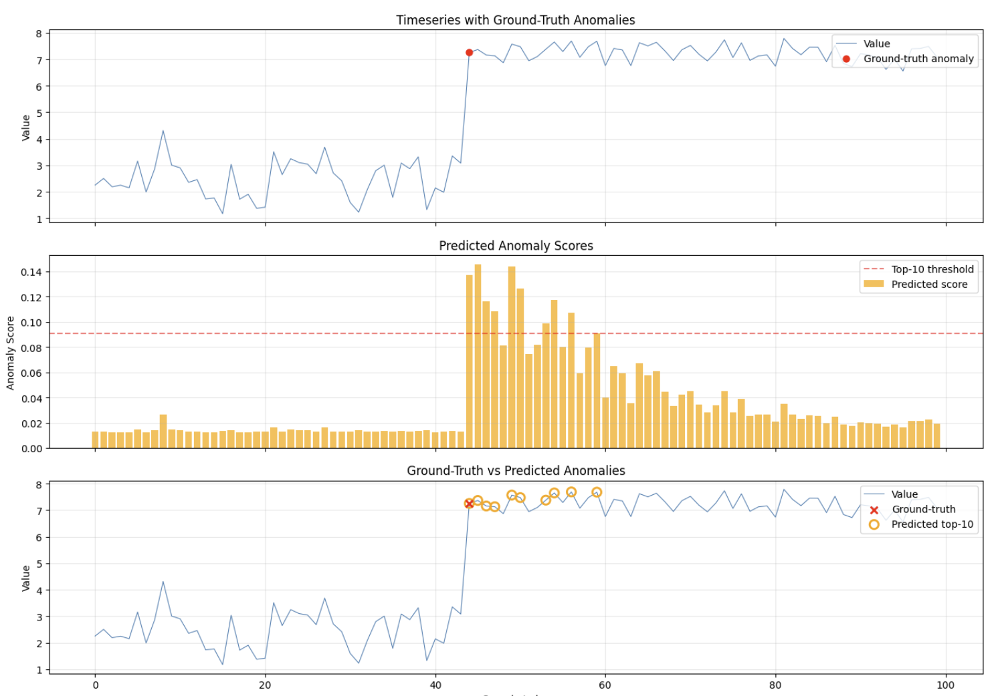
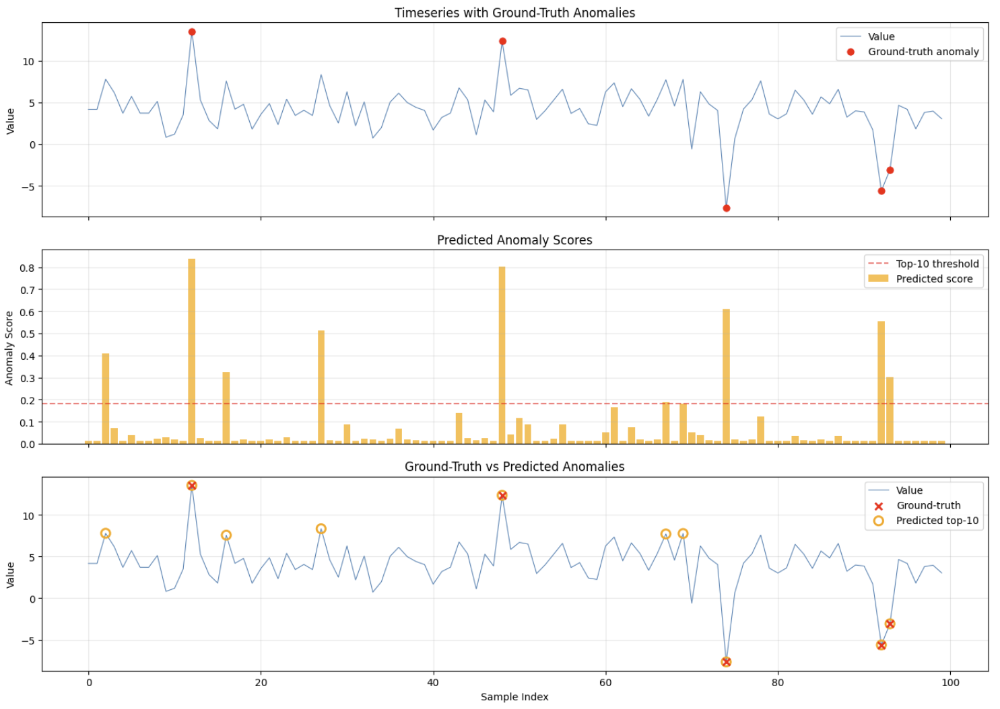

# AnomalyBERT

Anomaly detection in timeseries data using an encoder-only transformer architecture. Implemented as a Python library with a reference CLI.

## How the Model Works

### Architecture

AnomalyBERT is an encoder-only transformer (similar to BERT) designed for univariate timeseries anomaly detection. Given a series of `(timestamp, value)` pairs, it produces a per-timestep anomaly score in `[0, 1]` and returns the top-N most anomalous points.

```
Input: [(t1,v1), (t2,v2), ..., (tN,vN)]
         |
    Normalization (MinMax or ZScore)
         |
    Sliding Window Tokenization
    window_size=64, stride=1 --> K overlapping windows
         |
    Value Embedding: Linear(1 -> d_model)
    each scalar value projected to d_model-dimensional vector
         |
    Positional Encoding (sinusoidal, Vaswani et al.)
    injects position information into embeddings
         |
    Transformer Encoder (N layers)
    each layer: MultiHeadSelfAttention + FeedForward + LayerNorm + Residual
         |
    Anomaly Scoring Head: MLP -> Sigmoid
    per-timestep anomaly score in [0, 1]
         |
    Overlapping Window Aggregation (averaging)
         |
    Top-N Selection by score
```

### Key Components

**Tokenization**: The timeseries is split into overlapping sliding windows. Each window of length `window_size` becomes one input sequence for the transformer. Individual scalar values within the window are the "tokens", projected to `d_model` dimensions via a linear layer.

**Positional Encoding**: Sinusoidal encoding (Vaswani et al. 2017) adds position information without learnable parameters. This allows the model to understand temporal ordering within each window.

**Attention**: Custom multi-head self-attention implemented from scratch. Each encoder layer applies self-attention followed by a feedforward network, both with pre-norm residual connections.

**Scoring**: The anomaly scoring head is an MLP with sigmoid activation, producing a score per timestep. Overlapping window scores are averaged to produce a single score per original timestamp.

### Configurable Parameters

| Parameter | Description | Default |
|-----------|-------------|---------|
| `n_layers` | Number of transformer encoder layers (depth) | 3 |
| `d_model` | Embedding dimension (width) | 128 |
| `n_heads` | Number of attention heads | 4 |
| `d_ff` | Feedforward hidden dimension | 256 |
| `window_size` | Sliding window length | 64 |
| `stride` | Sliding window step size | 1 |
| `dropout` | Dropout rate | 0.1 |

### Training

Training uses supervised learning with labeled data. The training data format is CSV with columns:

| Column | Description |
|--------|-------------|
| `timestamp` | Integer timestamp |
| `value` | Numeric observation |
| `probability` | How much the value contributes to anomaly (0.0 to 1.0) |
| `anomaly_tag` | Binary label (0 = normal, 1 = anomaly) |

The loss function is binary cross-entropy between predicted anomaly scores and target probability values.

### Finetuning

A pre-trained model can be finetuned on domain-specific data. The finetuning mechanism freezes the encoder weights and trains only a replacement head, following standard transfer learning practice.

### Normalization

Values are normalized before being fed to the model. Supported algorithms:
- **MinMax** (default): scales values to `[0, 1]`
- **ZScore**: centers to mean=0, std=1

Normalization parameters are saved alongside the model checkpoint to ensure consistent inference.

## Installation

```bash
pip install -e ".[dev]"

# With ONNX export/inference support
pip install -e ".[dev,onnx]"
```

Requires Python 3.10+. Dependencies: PyTorch (CPU), NumPy, Pandas, scikit-learn, Click. ONNX support adds: onnx, onnxruntime, onnxscript.

## CLI Usage

### Generate Synthetic Data

```bash
# Generate all 8 scenarios with 100 samples each
anomalybert generate --output-dir data/synthetic --n-samples 100

# Generate a specific scenario
anomalybert generate --output-dir data/synthetic --scenario point_anomaly --n-samples 200

# Reproducible generation with a seed
anomalybert generate --output-dir data/synthetic --n-samples 100 --seed 42
```

Available scenarios: `point_anomaly`, `contextual_anomaly`, `collective_anomaly`, `seasonal_with_anomaly`, `trend_shift`, `noise_burst`, `frequency_change`, `flat_signal`.

Each call without `--seed` produces randomized data (different base signals, amplitudes, noise levels, anomaly positions).

### Train a Model

```bash
# Train on a single CSV file
anomalybert train --data data/synthetic/point_anomaly_100.csv --output models/model.pt --epochs 50

# Train on all CSVs in a directory
anomalybert train --data data/synthetic --output models/model.pt --epochs 50

# Train with custom architecture
anomalybert train --data data/synthetic \
    --output models/model.pt \
    --epochs 30 \
    --n-layers 4 \
    --d-model 128 \
    --n-heads 8 \
    --d-ff 256 \
    --window-size 32 \
    --batch-size 16 \
    --lr 0.001 \
    --normalization minmax

# Finetune a pre-trained model
anomalybert train --data new_data.csv --finetune models/model.pt --output models/finetuned.pt --epochs 10
```

### Detect Anomalies

```bash
# Print top 10 anomalies as a table
anomalybert detect --model models/model.pt --input data.csv --top-n 10

# Output as JSON
anomalybert detect --model models/model.pt --input data.csv --top-n 5 --format json

# Output as CSV
anomalybert detect --model models/model.pt --input data.csv --top-n 5 --format csv

# Save results to file
anomalybert detect --model models/model.pt --input data.csv --top-n 10 --output results.csv --format csv
```

Input CSV for detection requires only `timestamp` and `value` columns.

### Export to ONNX

Convert a trained PyTorch model to ONNX format for deployment without PyTorch:

```bash
# Export model to ONNX
anomalybert export --model models/model.pt --output models/model.onnx
```

This produces two files:
- `model.onnx` — the ONNX model graph and weights
- `model.onnx.json` — metadata (model config + normalizer parameters)

### Detect with ONNX Model

The `detect` command auto-detects `.onnx` files and uses `onnxruntime` for inference:

```bash
# Inference using ONNX model (no PyTorch needed at runtime)
anomalybert detect --model models/model.onnx --input data.csv --top-n 10
anomalybert detect --model models/model.onnx --input data.csv --top-n 5 --format json
```

ONNX and PyTorch inference produce identical results.

## Library Usage

```python
from anomalybert.model.config import ModelConfig
from anomalybert.model.anomalybert import AnomalyBertModel
from anomalybert.inference.detector import AnomalyDetector
from anomalybert.data.synthetic import generate_scenario, SyntheticScenario

# Generate synthetic data
df = generate_scenario(SyntheticScenario.POINT_ANOMALY, n_samples=100)

# Run inference with a trained model
detector = AnomalyDetector("models/model.pt")
results = detector.detect(
    timestamps=df["timestamp"].values,
    values=df["value"].values,
    top_n=5,
)

for r in results:
    print(f"timestamp={r['timestamp']}, value={r['value']:.4f}, score={r['score']:.4f}")
```

### ONNX Export and Inference

```python
from anomalybert.inference.onnx_export import export_to_onnx
from anomalybert.inference.onnx_detector import OnnxAnomalyDetector

# Export trained model to ONNX
export_to_onnx("models/model.pt", "models/model.onnx")

# Run inference with ONNX (no PyTorch dependency needed)
detector = OnnxAnomalyDetector("models/model.onnx")
results = detector.detect(timestamps, values, top_n=5)
```

## Testing

```bash
# Run all tests
pytest tests/ -v

# Run specific test module
pytest tests/test_model.py -v
```

Tests use synthetic datasets covering 8 anomaly scenarios at various cardinalities (10s to 100s of samples).

## Project Structure

```
src/anomalybert/
    model/          Transformer model (config, embedding, attention, encoder, heads)
    data/           Normalization, tokenizer, dataset, synthetic data generation
    training/       Loss function, trainer, checkpoint save/load
    inference/      AnomalyDetector, ONNX export, OnnxAnomalyDetector
    cli/            CLI commands (generate, train, detect, export)
tests/              Unit and integration tests
notebooks/          Jupyter notebook for visualizing results
```

# Results
Inference on trend data (random eval synthetic dataset)


Inference on point anomalies data (random eval synthetic dataset)
